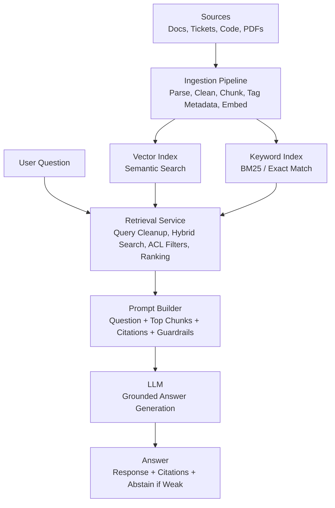
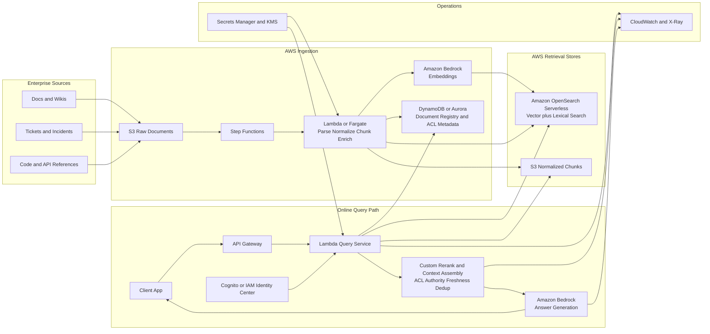
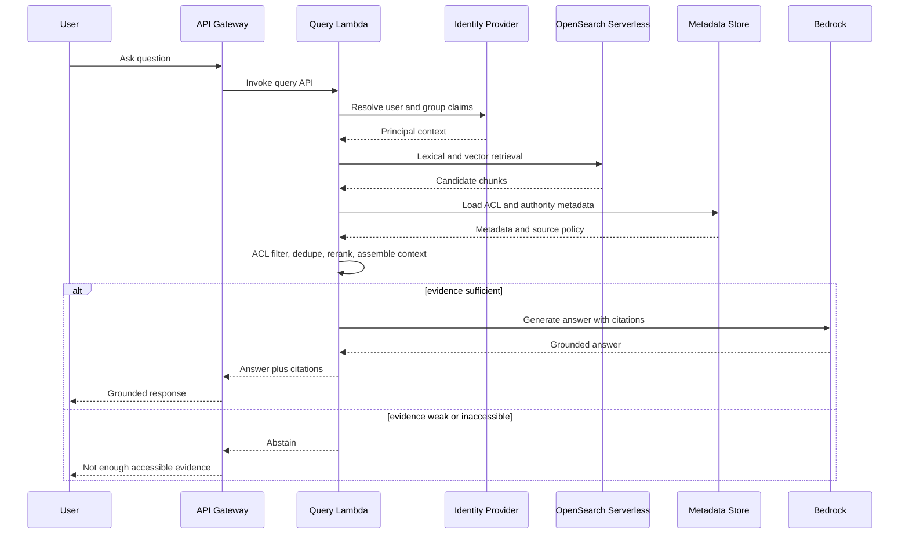

# Diagrams

## Simple One-Page Diagram

```mermaid
flowchart TB
    A[Sources<br/>Docs, Tickets, Code, PDFs] --> B[Ingestion Pipeline<br/>Parse, Clean, Chunk, Tag Metadata, Embed]

    B --> C[Vector Index<br/>Semantic Search]
    B --> D[Keyword Index<br/>BM25 / Exact Match]

    U[User Question] --> E[Retrieval Service<br/>Query Cleanup, Hybrid Search, ACL Filters, Ranking]

    C --> E
    D --> E

    E --> F[Prompt Builder<br/>Question + Top Chunks + Citations + Guardrails]
    F --> G[LLM<br/>Grounded Answer Generation]
    G --> H[Answer<br/>Response + Citations + Abstain if Weak]
```

## Technical Diagram

```mermaid
flowchart LR
    subgraph S[Source Systems]
        S1[Documentation<br/>Wiki, PDFs, Runbooks]
        S2[Ticketing / Incidents<br/>Jira, Service Desk]
        S3[Code / API References<br/>Repos, Generated Docs]
    end

    subgraph I[Ingestion and Indexing]
        I1[Connectors]
        I2[Normalization<br/>Canonical document schema]
        I3[Chunking<br/>Section-aware / code-aware]
        I4[Metadata Enrichment<br/>Source, version, ACL, timestamps, tags]
        I5[Embedding Generation]
        I6[Dedup / Version Resolution]
    end

    subgraph X[Storage and Search]
        X1[Document Store<br/>Raw + normalized content]
        X2[Vector Index<br/>Semantic nearest-neighbor search]
        X3[Keyword Index<br/>BM25 / exact token match]
        X4[Metadata / ACL Store]
    end

    subgraph R[Online Retrieval Path]
        R1[Query Intake API]
        R2[Query Processing<br/>cleanup, rewrite, entity extraction]
        R3[Hybrid Retrieval<br/>vector + keyword]
        R4[ACL / Metadata Filtering]
        R5[Reranker<br/>cross-encoder or scoring model]
        R6[Context Assembly<br/>top-k, dedupe, token budget]
    end

    subgraph G[Generation]
        G1[Prompt Builder<br/>question + evidence + instructions]
        G2[LLM Inference]
        G3[Post-processing<br/>citations, abstain, formatting]
    end

    subgraph O[Observability and Evaluation]
        O1[Tracing / Logs]
        O2[Offline Eval Set]
        O3[Metrics<br/>recall, precision, latency, cost, faithfulness]
    end

    U[User / App] --> R1

    S1 --> I1
    S2 --> I1
    S3 --> I1

    I1 --> I2
    I2 --> I3
    I3 --> I4
    I4 --> I5
    I4 --> I6

    I2 --> X1
    I3 --> X1
    I5 --> X2
    I4 --> X3
    I4 --> X4
    I6 --> X1

    R1 --> R2
    R2 --> R3
    X2 --> R3
    X3 --> R3
    R3 --> R4
    X4 --> R4
    R4 --> R5
    R5 --> R6
    X1 --> R6

    R6 --> G1
    G1 --> G2
    G2 --> G3
    G3 --> U

    R1 --> O1
    R3 --> O1
    R5 --> O1
    R6 --> O1
    G2 --> O1
    G3 --> O1

    O2 --> O3
    O1 --> O3
```

## AWS Deployment Diagram

```mermaid
flowchart LR
    subgraph Src[Enterprise Sources]
        Src1[Docs and Wikis]
        Src2[Tickets and Incidents]
        Src3[Code and API References]
    end

    subgraph AwsIngest[AWS Ingestion]
        S3Raw[S3 Raw Documents]
        SFN[Step Functions]
        Parse[Lambda or Fargate<br/>Parse Normalize Chunk Enrich]
        Embed[Amazon Bedrock<br/>Embeddings]
        Meta[DynamoDB or Aurora<br/>Document Registry and ACL Metadata]
    end

    subgraph Search[AWS Retrieval Stores]
        AOSS[Amazon OpenSearch Serverless<br/>Vector plus Lexical Search]
        S3Norm[S3 Normalized Chunks]
    end

    subgraph Online[Online Query Path]
        Client[Client App]
        APIGW[API Gateway]
        Query[Lambda Query Service]
        Auth[Cognito or IAM Identity Center]
        Rank[Custom Rerank and Context Assembly<br/>ACL Authority Freshness Dedup]
        Gen[Amazon Bedrock<br/>Answer Generation]
    end

    subgraph Ops[Operations]
        CW[CloudWatch and X-Ray]
        SM[Secrets Manager and KMS]
    end

    Src1 --> S3Raw
    Src2 --> S3Raw
    Src3 --> S3Raw

    S3Raw --> SFN
    SFN --> Parse
    Parse --> Embed
    Parse --> Meta
    Parse --> S3Norm
    Embed --> AOSS
    Parse --> AOSS

    Client --> APIGW
    APIGW --> Query
    Auth --> Query
    Query --> AOSS
    Query --> Meta
    Query --> S3Norm
    Query --> Rank
    Rank --> Gen
    Gen --> Client

    Query --> CW
    Rank --> CW
    Gen --> CW
    SM --> Parse
    SM --> Query
```

## AWS Sequence Diagram

```mermaid
sequenceDiagram
    participant U as User
    participant A as API Gateway
    participant Q as Query Lambda
    participant I as Identity Provider
    participant O as OpenSearch Serverless
    participant M as Metadata Store
    participant B as Bedrock

    U->>A: Ask question
    A->>Q: Invoke query API
    Q->>I: Resolve user and group claims
    I-->>Q: Principal context
    Q->>O: Lexical and vector retrieval
    O-->>Q: Candidate chunks
    Q->>M: Load ACL and authority metadata
    M-->>Q: Metadata and source policy
    Q->>Q: ACL filter, dedupe, rerank, assemble context
    alt evidence sufficient
        Q->>B: Generate answer with citations
        B-->>Q: Grounded answer
        Q-->>A: Answer plus citations
        A-->>U: Grounded response
    else evidence weak or inaccessible
        Q-->>A: Abstain
        A-->>U: Not enough accessible evidence
    end
```
